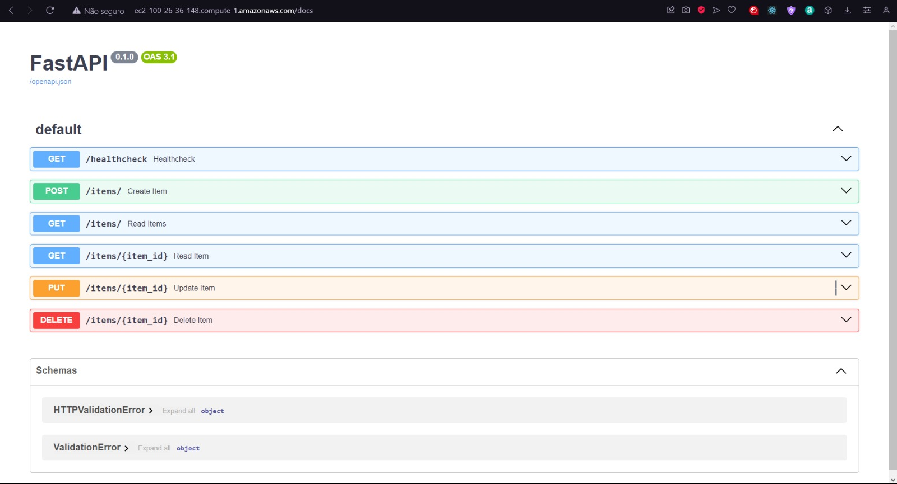
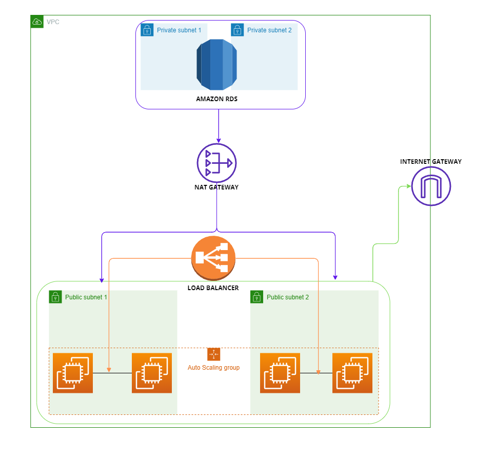
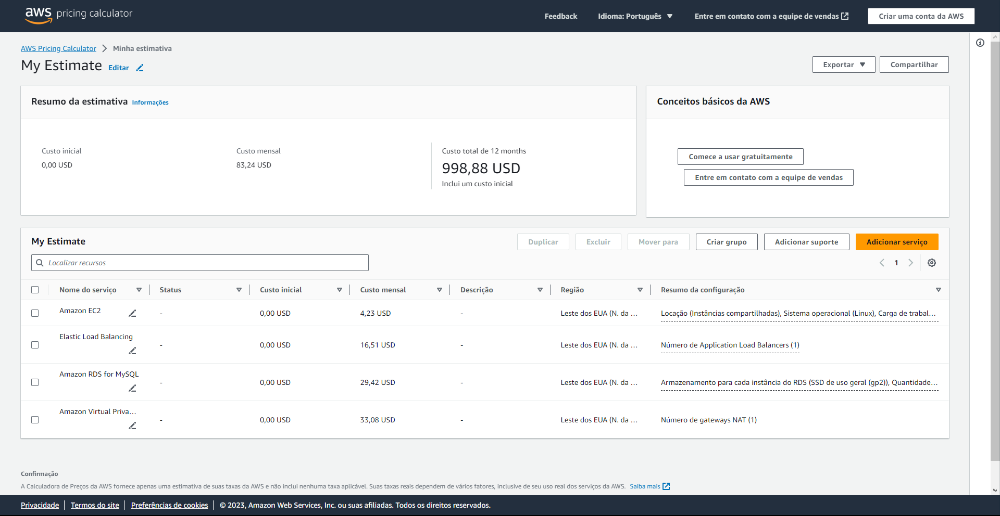

# Projeto de Computação em Nuvem - 2023.2
### Leonardo da França Moura de Andrade
----
### Descrição do projeto
O projeto consiste em provisionar uma arquitetura na AWS utilizando o Terraform, que englobe o uso de um Application Load Balancer (ALB), instâncias EC2 com Auto Scaling e um banco de dados RDS.


### Utilização do projeto
Para utilizar o projeto, em primeiro lugar, é necessário possuir a AWS CLI configurada, com as credenciais de acesso e a região configuradas.

```
export AWS_ACCESS_KEY_ID="sua_access_key"
export AWS_SECRET_ACCESS_KEY="sua_secret_key"
export AWS_DEFAULT_REGION="sua_region"
```

Ainda, é necessário ter um bucket S3 para armazenar o estado do Terraform. No caso, foi criado um bucket chamado "leofmandradebucket".

Após isso, é necessário ter o Terraform instalado. Por fim, basta clonar o repositório. Essa última etapa pode ser feita com os seguintes comandos:
```
terraform init
terraform plan -var="db_password=flamengo" -var="db_username=admin"
```
```
terraform apply -auto-approve -var="db_password=flamengo" -var="db_username=admin"
```

Para destruir a infraestrutura criada, basta executar o seguinte comando:
```
terraform destroy -auto-approve 
```

----


### Descrição dos recursos
### VPC
A VPC é a Virtual Private Cloud, que é um serviço que permite a criação de uma rede virtual na AWS. Além disso, a VPC permite a criação de subnets, internet gateways, route tables e security groups, que são recursos que serão descritos a seguir e que são essenciais para a criação de uma arquitetura na AWS. Nesse projeto, foi criada uma VPC com o CIDR `10.0.0.0/16`. 

### Internet Gateway
O Internet Gateway é um serviço que permite a comunicação entre a VPC e a internet. Nesse projeto, foi criado um Internet Gateway e associado à VPC criada. 

### NAT Gateway
O NAT Gateway é um serviço que permite a comunicação entre as subnets privadas e as subnets públicas. Nesse projeto, foi criado um NAT Gateway e associado à VPC criada.

### Subnets
As subnets são redes dentro da VPC. Nesse projeto, foram criadas 4 subnets, sendo 2 públicas e 2 privadas. As subnets públicas são associadas ao Internet Gateway e as privadas são associadas ao NAT Gateway. No caso desse projeto, as subnets públicas são utilizadas para a criação das instâncias EC2 e tem os IPs de `10.0.0.96/27` e `10.0.0.128/27` em regiões diferentes para garantir a alta disponibilidade da aplicação. Já as subnets privadas são utilizadas para a criação do banco de dados RDS e tem os IPs de `10.0.1.96/27` e `10.0.1.128/27`. 

### Security Groups
Os Security Groups são grupos de segurança que definem as regras de entrada e saída de tráfego para os recursos da VPC. Nesse projeto, foram criados 3 Security Groups, um para as instâncias EC2, um para o banco de dados RDS e um para o Application Load Balancer.

### RDS
O RDS é um serviço de banco de dados relacional da AWS. Nesse projeto, foi criado um banco de dados MySQL com a classe db.t2.micro, que é a menor disponível. Além disso, foi habilitado o Multi-AZ para garantir a alta disponibilidade do banco de dados. Por fim, foi criado um Security Group para garantir que apenas as instâncias EC2 possam se conectar ao RDS. Esse recurso foi utilizado para garantir a persistência dos dados da aplicação.

### EC2
O EC2 é um serviço de computação da AWS. Nesse projeto, foi criado um Launch Template para a criação das instâncias EC2, que são instâncias do tipo t2.micro com o sistema operacional Ubuntu 20.04. Além disso, foi criado um Auto Scaling Group para gerenciar as instâncias EC2, que possui uma política de escalonamento para aumentar e diminuir o número de instâncias de acordo com a utilização da CPU. Por fim, foi criado um Application Load Balancer para distribuir o tráfego entre as instâncias EC2.

### Load Balancer
Como dito anteriormente, o Load Balancer foi criado para distribuir o tráfego entre as instâncias EC2. Além disso, foi criado um Target Group para gerenciar as instâncias EC2 e foi implementado Health Checks para garantir que o tráfego seja direcionado apenas para instâncias saudáveis. Esse recurso foi utilizado para garantir que a aplicação seja escalável e um pouco mais tolerante a falhas.

### Auto Scaling 
O Auto Scaling (serviço que gerencia o número de instâncias EC2 de acordo com a utilização da CPU), nesse projeto, foi configurado com uma aplicação pré-instalada e com uma política de escalabilidade baseada em CloudWatch Alarms. O CloudWatch é um serviço de monitoramento da AWS. Essa política aumenta o número de instâncias EC2 quando a utilização da CPU for maior que 70% e diminui o número de instâncias EC2 quando a utilização da CPU for menor que 10%. Por fim, pode-se concluir que esses recursos foram utilizados para garantir não só a alta disponibilidade da aplicação, mas também a escalabilidade da mesma.

### Aplicação
A aplicação utilizada foi uma API RESTful. Essa API possui 6 endpoints, sendo eles:
- GET /healthcheck: retorna o status da aplicação
- POST /items: cria um novo item no banco de dados
- GET /items: retorna todos os itens do banco de dados
- GET /items/{id}: retorna um item específico do banco de dados, de acordo com o id
- PUT /items/{id}: atualiza um item específico do banco de dados, de acordo com o id
- DELETE /items/{id}: deleta um item específico do banco de dados, de acordo com o id

Ou seja, essa API é capaz de se conectar ao banco de dados RDS e realizar operações CRUD. A imagem abaixo mostra a aplicação sendo executada em uma instância EC2:



Para acessá-la, é necessário utilizar o DNS IPv4 público ou o Endereço IPv4 público da instância EC2. Assim é possível acessar a documentação da API, por exemplo, com um IP público `100.26.36.148`:

```
100.26.36.148/docs
```


----

### Diagrama da arquitetura
A infraestrutura descrita acima pode representada pelo diagrama a seguir:



----

### Custos


Como pode ser visto na imagem acima, o custo da infraestrutura é de 83,24 USD/mês e de 998,88 USD/ano. Esse custo é composto por 4 serviços: EC2, RDS, VPC e Load Balancer. Por mês, temos os seguintes custos:
- EC2: 4,23 USD/mês
- RDS: 29,42 USD/mês
- VPC: 33,08 USD/mês
- Load Balancer: 16,51 USD/mês

Uma das maneiras de reduzir o custo da infraestrutura é utilizar instâncias EC2 com menor poder de processamento, como por exemplo, as instâncias do tipo t2.nano, que são mais baratas que as instâncias do tipo t2.micro. 